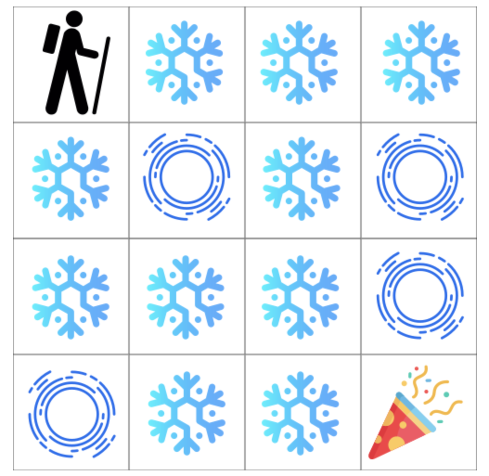
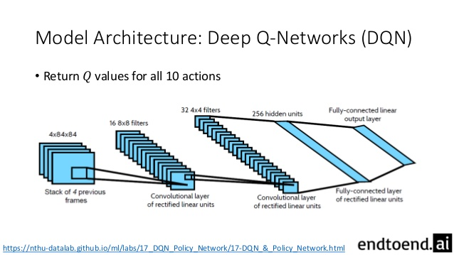
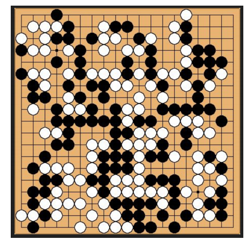

---
header-includes:
  - \hypersetup{colorlinks=true,
            allbordercolors={0 0 0},
            pdfborderstyle={/S/U/W 1}}
---

_CS-GY 9223, Fall 2020_

# Reinforcement Learning (II)

Recall that in the previous lecture we talked about a new *mode* of ML called reinforcement learning (RL), where the observations occur in a dynamic environment, and the learning module (also called the *agent*) needs to figure out the best sequence of actions to be taken (also called the policy) in order to maximize a given objective (also called the reward).

We also discussed a method called *Policy Gradients*, which uses the log-derivative trick to rewrite the problem in such a way that we can use standard ML tools (such as SGD) to learn a good RL policy. This led to an algorithm called REINFORCE (or Monte Carlo Policy Search), which can be viewed as an instantiation of random search used in derivative-free optimization.

(Aside: notice that nowhere in the above discussion did *deep learning* show up -- indeed, RL can be used in very general settings. In the context of policy gradients, deep learning arises only if we choose to parameterize the policy in terms of a deep neural network.)

Today, we will learn about a *different* family of RL approaches which does something slightly different.

## Q-Learning

Recall the setup in policy gradients:

* The agent receives a sequence observations (in the form of e.g. image pixels) about the environment.
* The state at time $t$, $s_t$, is the instantaneous relevant information of the agent.
* The agent can choose an action, $a_t$, at each time step $t$ (e.g. go left, go right, go straight). The next state of the game is determined by the current state and the current action:
$$
s_{t+1} \sim f(s_t, a_t) .
$$
Here, $f$ is the *state transition* function that is entirely determined by the environment. We use the symbol $\sim$ to denote the fact that environments could be random and an action may sometimes have unpredictable consequences.
* The agent periodically receives rewards/penalties as a function of the current state and action, $r_t = r(s_t,a_t)$.
* The sequence of state-action pairs $\tau_t = (s_0, a_0, s_1, a_1, \ldots, a_t, s_t)$ is called a *trajectory* or *rollout*. The rollout is usually defined over a fixed time horizon $L$. In policy gradients, our goal is to minimize the (negative) reward:
$$
\begin{aligned}
\text{minimize}~&R(\tau) = \sum_{t=0}^{L-1} - r(s_t, a_t), \\
\text{subject to}~&s_{t+1}  \sim f(s_t,a_t) \\
& a_t \sim \pi(\tau_t) .
\end{aligned}
$$

Let us now think of the problem in a slightly different fashion, which is somewhat more applicable in the context of goal-oriented RL. Instead of choosing good *actions* to take at each time step, an alternative is to identify (a sequence of) good *states* to visit. For simplicity, it is convenient to assume discrete spaces for both states and actions. It is also convenient to think in terms of *episodes* instead of rollouts. So each episode could be viewed as one run of a game.

This makes sense in the context of games: the ultimate goal is to reach the "win" state, just as how the ultimate goal in chess is to have the board result in a "checkmate" of the opponent. A common simple example given in the RL literature is the game of *Frozen Lake* (taken from OpenAI Gym), where the objective is to skate along the surface of a (frozen) lake, modeled as a 4x4 grid, from a starting position to the goal without falling into any "holes" in the lake. (The ice is slippery, so there is some randomness in the environment.)

{ width=35% }

This is a rather simple game (there are 16 states, and 4 actions per state). But one could model more complex RL problems too in this manner. In autonomous navigation, for example, the ultimate state is achieved when the agent has reached the destination, and other states along the leading to this final "win" state are likely to be also good states.

(In fact, this idea of looking backwards from the "win" state, and identifying which states lead to wins, is exactly the same principle that we use in *dynamic programming* (DP). As we will see soon, what we will discuss below can be viewed as an approximate version of DP.)

The way we characterize "good states" is by a quantity called the *value function*. To understand this, we first need to define the *return*, which is the sum of all anticipated rewards in the future over an infinite time horizon. In practice, we cannot sum over infinitely many rewards so we discount future rewards by a decay factor $\gamma$, leading to the *discounted return*:
$$
G_t = r_t + \gamma r_{t+1} + \gamma^2 r_{t+2} + \ldots
$$
"Good states" are likely to provide good returns, provided a sensible policy is chosen. The value function of a state $s$ under a given policy $\pi$ is defined as the expected discounted return if we start at $s$ and obey $\pi$:
$$
V^{\pi}(s) = \mathbb{E} [G_t | s_t = s] =  \mathbb{E} [ \sum_{i=0}^\infty \gamma^i r_{t+i} | s_t = s] .
$$
The value function gives us a way to identify good states versus not-so-good ones, but it does not quite tell us how to *reach* these states. In order to do so, we need to go one more step: define an *action-value* function, or a *Q-function*, which is defined as the expected discounted return if we start at $s$, take action $a$, and subsequently follow the policy:
$$
Q^{\pi}(s,a) = \mathbb{E} [G_t | s_t = s, a_t = a] .
$$
Since we have assumed (for convenience) that both the state and action spaces are discrete, we can think of the Q-function as a giant table (similar to the table that we encounter in DP). Also, by law of iterated expectation, we can link the Q-function and the value function by just averaging over all possible actions, weighted by the likelihood of choosing action $a$ under the policy:
$$
V^{pi} = \sum_a \pi(a | s) Q^{pi}(s,a) .
$$

The Q-function gives us a way to determine the optimal policy as follows. If the Q-function were available (somehow, and we will discuss how to learn it), we could just choose optimal actions by picking the one that maximizes the expected return:
$$
\pi^*(s) = \arg \max_a Q(s,a)
$$

All this sounds good, but how do actually we discover the Q-function? And where does learning enter the picture?

### Algorithms for Q-learning

The key to Q-learning is a recursive characterization of the optimal Q-function called the *Bellman Equation*, similar to how DP tables are recursively constructed. There is a formal derivation in the probabilistic case, which we won't derive here. But intuitively the Bellman equation states that if the policy is optimally chosen, then the $Q$ function at the current time step is the current reward, plus the *best* return achievable at the *next* time step.
$$
Q^*(s_t,a_t) = r(s_t,a_t) + \gamma \max_{a'} Q^* (s_{t+1},a')
$$

The Bellman equation also gives us a way to perform *learning* in the RL setting. We start with an estimate of the $Q$-function (say, an empty table, or a table with random values). We start at some state $s$, take an action, collect a reward $r$, and then move to the next state $s'$ (in short, the quadruple $(s,a,r,s')$). The *Bellman error* is defined as the mean-squared error between the current estimate $Q$ and the predicted estimate:
$$
l = \frac{1}{2} (r_t + \gamma \max_{a'} Q(s,a') - Q(s,a))^2
$$
which is a quantity that we (as ML engineers) love to see, since we can immediately use this error term to perform gradient descent:
$$
Q(s,a) \leftarrow Q(s,a) + \eta \left[ r + \gamma \max_{a'} Q(s',a') - Q(s,a) \right]
$$
and that's it! The above procedure can be repeated by sampling different states and actions, observing the rewards, and updating the Q-function as we go along.

There is a small catch here though: note that this limits $Q$-learning to visited states and actions; but next actions are picked according to the table itself, which are plausibly optimal. This means that certain state-action pairs are never visited.  Sometimes the agent needs to pick *sub*-optimal actions in order to visit new states; this is a common issue in RL called the *exploration-exploitation tradeoff*.

The easy fix is to choose an $\epsilon$-*greedy policy*: with probability $\epsilon$, we choose a random action, and with probability $1-\epsilon$, we choose the optimal action according to $Q$. So the overall algorithm becomes the following.

Initialize $Q$, repeat (for each episode):

* Initialize $s$
* Repeat for each step of episode:
    - Choose an action $a$ using $\epsilon$-greedy policy
    - Take action $a$, observe reward $r$ and state $s'$
    - $Q(s,a) \leftarrow Q(s,a) + \eta \left[ r + \gamma \max_{a'} Q(s',a') - Q(s,a) \right]$
    - $s \leftarrow s'$
* Until $s$ is the end-state

The above algorithm can be implemented with any game engine/simulator.

### Deep Q-learning

So far, we have imagined both actions and states to be discrete spaces, and hence $Q$ is a table.

There are two issues here:

* Impractical (too many states in many cases, even infinite if we are talking about continuous environments)
* No structure/shared information between states and actions

Similar to policy gradients, one can resolve this by *parameterizing* the $Q$-function. This can be done in a few different ways. For example, we could do a *linear function approximation*:
$$
Q(s,a) = w^T \psi(s,a)
$$
where $\psi$ is some feature embedding of the tuple $(s,a)$. (As to where the embedding comes from: this is identical to the challenge of "word embeddings" for NLP, and similar techniques can be used here, which we won't discuss.)

Or, alternatively, we could think of $Q$ to be some deep neural network, parameterized by weights $w$. The latter would be called *deep Q-learning*. One can prove that the Bellman equation remains the same, so the only thing that changes is the gradient descent equation:
$$
\begin{aligned}
t &\leftarrow r + \gamma \max_{a'} (t - Q(s',a')) \\
w &\leftarrow w + (t - Q(s,a)) \frac{\partial Q(s,a)}{\partial w}
\end{aligned}
$$

A bit of history: among the several breakthroughs in deep learning that happened in the early 2010s was the success of neural nets to crack 80's-style Atari games in 2013. A rather shallow network with 3 hidden layers was used; see Figure 2.

{ width=55% }

### Comparisons with policy gradients

In contrast with policy gradients (which directly learn policies), Q-learning introduces an intermediate quantity (the Q-function) that explicitly assigns value to states and actions.

Pros of policy gradients:

* There is no Q-function table to be populated, so one can handle large, or even continuous, action spaces.
* No need to model intermediate variables (such as Value/Q-function); the model directly estimates the policy.
* Unlike Q-learning (where the final optimal policy is deterministic: it is the max over all actions for a given state), policy gradients can output stochastic/non-deterministic policies. This is useful in games without stable equilibria (such as Rock-Paper-Scissors) where there is no single deterministic policy that is the best.

Pros of DQN:

* Q-learning is (generally) more sample-efficient (recall policy gradients are similar to random search). Therefore, with a fixed number of episodes/training data, Q-learning tends to perform better.
* Q-learning gives an estimate of anticipated return at each time step, which can be useful in higher-level planning, reasoning, and control tasks.

## AlphaGo

We will conclude by quickly discussing AlphaGo, which was one of the success stories of deep RL in real(istic) applications.

Go is a two-player board game where the players take turns placing black "stones" on a 19x19 grid, and the goal is to surround the opponents' pieces and "capture" territory. The winner is declared by counting each player's surrounded territory.

{ width=40% }

The classical way to solve such two player games (and other like Chess) via AI is to search a *game tree*, where each node in the tree is a game state (or snapshot) and children nodes are results of possible actions taken by each player.  The leaves of the tree denote end states, and the goal of the AI is to discover paths to valuable/winning leaves while avoiding bad paths. Leaving aside the definition of "value", this is obviously a very large tree in both Chess and Go with leaves the number of leaves being exponential in the depth (i.e., the number of moves in the game).

[An aside: in Chess after sufficiently many moves there is a particular phase called the *Endgame*, after which the winning sequence of moves are more or less well understood, and can be hard coded. Computer chess heavily relied on this particular trick; unfortunately, endgames in Go are way more complicated, and solving Go via computer was viewed as a major bottleneck.]

One way to reduce the number of possible paths is to perform *Monte Carlo Tree Search*, which was a crude form of estimating the *Value function* $V(s)$ of each state (i.e., each node in the tree) via random search.

The beauty of DeepMind's AlphaGo (which was introduced in 2016) is that it completely eschews a tree-based data structure for representing the game. Instead, the state of the game is represented by a 19x19 black/white/gray *image*, which is fed into a deep neural network -- just like how we would classify an MNIST grayscale image. The output of the network is the instantaneous policy, i.e., distribution over possible next moves. The architecture is a vanilla 13-layer convnet.

In fact, just this network is enough to do well in Go. One can train this in a standard supervised learning manner using an existing database of game-state/next-move pairs, and beat computer Go players based on tree search nearly 99% of the time! But top human players were able to beat this model.

But AlphaGo leverages the fact that we can do even better with RL. We can update the above network using *self-play*, where we create new games by sampling rollouts using the predicted distribution, measure rewards at the end of the game, and use the REINFORCE algorithm for further updating the weights.

In addition to the policy network trained above, AlphaGo also constructs a second network (called the *value* network) which, for a given state, predicts which player has advantage. In some sense, one can view this analogous to how we motivated GANs: the policy network proposes actions to take, and the value network evaluates how good different actions are in terms of expected return. [Such an approach is called an *actor-critic method*.] There were other additional hacks thrown on top to make everything work, but this is the gist. Read the (very enjoyable) [paper](https://www.nature.com/articles/nature16961) if you would like to learn more.
